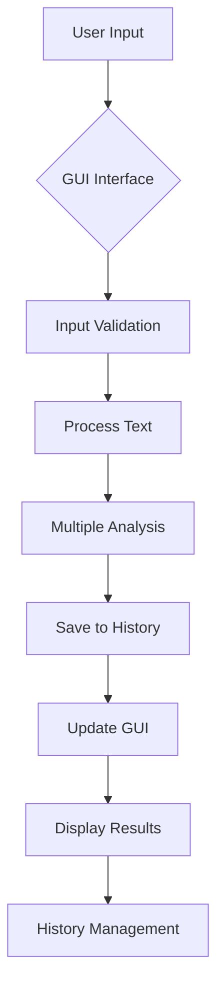

# 🔄 Analisis Text

<div align="center">


**Program analisis text untuk membalik kalimat dan menganalisis teks secara lengkap**

</div>

## 📋 Daftar Isi

- [Gambaran Umum](#-gambaran-umum)
- [Fitur](#-fitur)
- [Instalasi](#-instalasi)
- [Penggunaan](#-penggunaan)
- [Dokumentasi](#-dokumentasi)
- [Contoh Penggunaan](#-contoh-penggunaan)
- [FAQ](#-faq)

## 🚀 Gambaran Umum

**Program Analisis Text** adalah aplikasi GUI modern yang dikembangkan untuk menganalisis teks secara komprehensif. Aplikasi ini tidak hanya mampu membalik kalimat seperti versi konsol sebelumnya, tetapi juga dilengkapi dengan berbagai fitur analisis teks lengkap, sistem penyimpanan riwayat otomatis, dan antarmuka pengguna yang intuitif.

### ✨ Highlights

- 🎨 **GUI Modern** dengan antarmuka yang user-friendly
- 📊 **Analisis Lengkap** - vokal, konsonan, kata, dan karakter
- 💾 **Riwayat Otomatis** - penyimpanan hingga 50 analisis terakhir
- 🔄 **Preview Real-time** - lihat perubahan saat mengetik
- 📁 **Multi-tab Interface** - navigasi yang terorganisir
- 🚀 **Performance Optimized** - cepat dan responsif

## 🌟 Fitur

### 🔤 Core Features
- **Pembalikan Kalimat** - Membalik urutan karakter dengan sempurna
- **Analisis Vokal** - Menghitung jumlah huruf vokal (a,i,u,e,o)
- **Analisis Konsonan** - Menghitung jumlah huruf konsonan
- **Penghitungan Kata** - Analisis jumlah kata dalam kalimat
- **Total Karakter** - Menghitung semua karakter termasuk spasi

### 💾 Data Management
- **Auto-save History** - Setiap analisis langsung tersimpan
- **JSON Storage** - Format penyimpanan terstruktur
- **Riwayat Terorganisir** - Akses mudah ke analisis sebelumnya
- **Batch Processing** - Dapat memproses multiple kalimat
- **Data Persistence** - Data tetap aman setelah aplikasi ditutup

### 🎨 GUI Features
- **Clean Interface** - Antarmuka bersih dan modern
- **Real-time Preview** - Lihat input saat mengetik
- **Tab Navigation** - Beralih mudah antara hasil dan riwayat
- **Responsive Design** - Adaptif berbagai ukuran layar
- **Visual Feedback** - Notifikasi dan konfirmasi actions

### ⚡ Utility Features
- **Quick Clear** - Hapus input dengan satu klik
- **History Management** - Lihat dan hapus riwayat
- **Error Handling** - Penanganan error yang elegan
- **Input Validation** - Validasi input otomatis
- **Keyboard Shortcuts** - Navigasi dengan keyboard


## 📥 Instalasi

### Prerequisites

- Python 3.7 atau lebih tinggi
- pip (Python package manager)
- Tkinter (biasanya sudah termasuk dengan Python)

### Step-by-Step Installation

1. **Download atau Clone Project**
   ```bash
   git clone https://github.com/username/program-analisis-kalimat.git
   cd program-analisis-kalimat
   ```

2. **Buat Virtual Environment (Recommended)**
   ```bash
   python -m venv kalimat_env
   # Windows
   kalimat_env\Scripts\activate
   # Linux/Mac
   source kalimat_env/bin/activate
   ```

3. **Verifikasi Tkinter**
   ```bash
   python -m tkinter
   ```
   Jika muncul window tkinter, berarti sudah terinstall dengan benar.

4. **Jalankan Program**
   ```bash
   python main.py
   ```

### Quick Install (Windows)
```bash
# Download semua file ke satu folder
python main.py
```

## 🎮 Penggunaan

### Menjalankan Aplikasi

```bash
python main.py
```

### Basic Usage

1. **Input Kalimat**
   - Ketik atau paste kalimat di text area "Masukkan kalimat"
   - Lihat preview real-time di bagian bawah

2. **Proses Analisis**
   - Klik tombol "Proses Kalimat" atau tekan `Enter`
   - Hasil akan muncul di tab "Hasil Utama"

3. **Melihat Riwayat**
   - Klik tab "Riwayat" untuk melihat analisis sebelumnya
   - Gunakan tombol "Muat Ulang Riwayat" untuk refresh

### Fitur Lengkap

| Fitur | Cara Menggunakan |
|-------|------------------|
| **Balik Kalimat** | Otomatis setelah proses |
| **Hitung Vokal** | Lihat di hasil analisis |
| **Hitung Konsonan** | Lihat di hasil analisis |
| **Hitung Kata** | Lihat di hasil analisis |
| **Total Karakter** | Lihat di hasil analisis |
| **Clear Input** | Klik tombol "Hapus Input" |
| **Clear History** | Klik tombol "Hapus Riwayat" di tab riwayat |

### Keyboard Shortcuts

| Shortcut | Action |
|----------|--------|
| `Ctrl + A` | Select all text |
| `Ctrl + C` | Copy text |
| `Ctrl + V` | Paste text |
| `Enter` | Proses kalimat (jika tombol aktif) |
| `Tab` | Navigasi antara elemen |

## 📚 Dokumentasi

### Workflow



---

### File Descriptions

| File | Description |
|------|-------------|
| `main.py` | Entry point aplikasi, menjalankan GUI |
| `gui.py` | Kelas utama untuk antarmuka pengguna |
| `kalimat_utils.py` | Fungsi-fungsi utilitas analisis teks |
| `history_manager.py` | Kelas untuk mengelola penyimpanan riwayat |
| `history.json` | Penyimpanan data riwayat (auto-generated) |


## 💡 Contoh Penggunaan

### Basic Analysis
```
Input: "Halo dunia pemrograman Python"

Hasil:
• Kalimat Asli: Halo dunia pemrograman Python
• Kalimat Dibalik: nohtyP namargormep ainud olaH
• Jumlah Vokal: 11
• Jumlah Konsonan: 16  
• Jumlah Kata: 4
• Total Karakter: 30
```

### Advanced Examples

```
Contoh 1 - Kalimat Panjang:
Input: "Program ini sangat berguna untuk analisis teks secara real-time"
• Total Karakter: 62
• Jumlah Kata: 9
• Vokal: 22, Konsonan: 31

Contoh 2 - Kalimat dengan Angka:
Input: "Python 3.11 dirilis pada tahun 2022"
• Total Karakter: 34
• Jumlah Kata: 6
• Vokal: 9, Konsonan: 14

Contoh 3 - Kalimat dengan Simbol:
Input: "Hello @world! #Programming is fun!!"
• Total Karakter: 35
• Jumlah Kata: 4
• Vokal: 9, Konsonan: 17
```

### Use Cases

2. **Pemrograman** - Analisis string dan teks
3. **Pendidikan** - Alat bantu belajar bahasa
4. **Content Writing** - Optimasi konten tulisan
5. **Research** - Analisis data teks sederhana


## ❓ FAQ

### Q: Data riwayat disimpan di mana?
**A:** Data disimpan di file `history.json` dalam folder yang sama dengan program.

### Q: Apakah bisa import teks dari file?
**A:** Saat ini belum, tapi fitur ini bisa ditambahkan di versi mendatang.

### Q: Bagaimana cara backup data riwayat?
**A:** Cukup backup file `history.json` yang berisi semua riwayat analisis.

### Q: Apakah support Unicode/emojis?
**A:** Ya, program fully support Unicode characters termasuk emojis.

### Q: Bisakah diintegrasikan dengan aplikasi lain?
**A:** Bisa! Modul analisis teks dapat diimport ke project Python lain.


<div align="center">

**⭐ Jika project ini membantu, jangan lupa beri bintang! ⭐**

[Kembali ke Atas](#-analisis-kalimat)

</div>